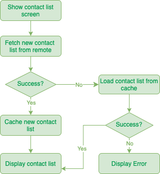
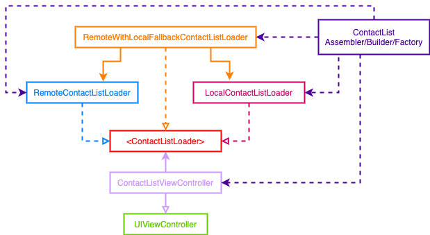

# PicPay Challenge App

[](https://travis-ci.org/anacamargos/picpay-challenge)

It consists of developing a native iOS app implemented in Swift. It is a simulation of sending money to another person via credit card.

The user must choose a contact from a list, inform the amount to be sent and finalize the payment with the registered credit card. If there is no credit card registered, you must also inform it (card number, expiration date and CVV) before finalizing the payment.

Cards must be persisted in the app to be used for future payments.

# Contact List Feature

- [BDD Specs](#bdd-specs)
- [Use Cases](#use-cases)
- [Flowchart](#flowchart)
- [Architecture](#architecture)
- [Model Specs](#model-specs)


## BDD Specs

### Story: Customer requests to see their contact list

### Narrative #1

```
As an online customer
I want the app to automatically load my contacts
So I can always see my friends
```

#### Scenarios (Acceptance criteria)

```
Given the customer has connectivity
When the customer requests to see their contact list
Then the app should display the latest contact list from remote
And replace the cache with the new contact list
```

### Narrative #2

```
As an offline customer
I want the app to show the latest saved version of my contact list
So I can always see my friends
```

#### Scenarios (Acceptance criteria)

```
Given the customer doesn't have connectivity
  And there’s a cached version of the contact list
  And the cache is less than seven days old
 When the customer requests to see the contact list
 Then the app should display the latest contact list saved

Given the customer doesn't have connectivity
  And there’s a cached version of the contact list
  And the cache is seven days old or more
 When the customer requests to see the contact list
 Then the app should display an error message

Given the customer doesn't have connectivity
  And the cache is empty
 When the customer requests to see the contact list
 Then the app should display an error message
```

## Use Cases

### Load Contact List From Remote Use Case

#### Data:
- URL

#### Primary course (happy path):
1. Execute "Load Contact List" command with above data.
2. System downloads data from the URL.
3. System validates downloaded data.
4. System creates contact list from valid data.
5. System delivers contact list.

#### Invalid data – error course (sad path):
1. System delivers invalid data error.

#### No connectivity – error course (sad path):
1. System delivers connectivity error.

---

### Load Contact List From Cache Use Case

#### Primary course:
1. Execute "Load Contact List" command with above data.
2. System retrieves contact list data from cache.
3. System validates cache is less than seven days old.
4. System creates contact list from cached data.
5. System delivers contact list.

#### Retrieval error course (sad path):
1. System delivers error.

#### Expired cache course (sad path): 
1. System delivers no contact list.

#### Empty cache course (sad path): 
1. System delivers no contact list.

---

### Cache Contact List Use Case

#### Data:
- Contact List

#### Primary course (happy path):
1. Execute "Save Contact List" command with above data.
2. System deletes old cache data.
3. System encodes contact list.
4. System timestamps the new cache.
5. System saves new cache data.
6. System delivers success message.

#### Deleting error course (sad path):
1. System delivers error.

#### Saving error course (sad path):
1. System delivers error.

---

### Validate Contact List Cache Use Case

#### Primary course:
1. Execute "Validate Cache" command with above data.
2. System retrieves contact list data from cache.
3. System validates cache is less than seven days old.

#### Retrieval error course (sad path):
1. System deletes cache.

#### Expired cache course (sad path): 
1. System deletes cache.

---

## Flowchart




## Architecture




## Model Specs

### Contact Data

| Property      | Type                |
|---------------|---------------------|
| `id`          | `Int`               |
| `name`        | `String`            |
| `imageURL`    | `URL`               |
| `username`	  | `String`            |

### Payload contract

```
GET *url* (TBD)

200 RESPONSE

[
   {
      "id": 1001,
      "name": "Eduardo Santos",
      "img": "https://randomuser.me/api/portraits/men/9.jpg",
      "username": "@eduardo.santos"
   },
   {
      "id": 1002,
      "name": "Marina Coelho",
      "img": "https://randomuser.me/api/portraits/women/37.jpg",
      "username": "@marina.coelho"
   },
   {
      "id": 1003,
      "name": "Márcia da Silva",
      "img": "https://randomuser.me/api/portraits/women/57.jpg",
      "username": "@marcia.silva"
   }
   ...
]
```
